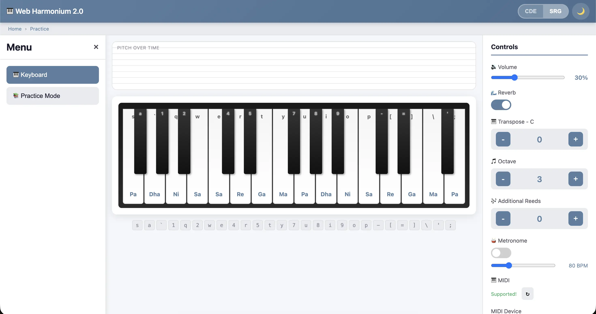
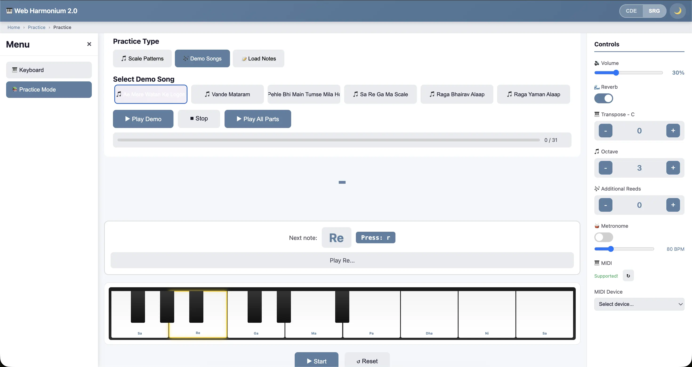

<h1 align="center">Web Harmonium - Free Online Virtual Harmonium</h1>

<p align="center">
  <a href="LICENSE"></a>
  <a href="https://webharmoniumv2.vercel.app/"></a>
  <a href="http://makeapullrequest.com"></a>
</p>

<p align="center">A free, browser-based virtual harmonium keyboard for practicing Indian classical music. Play authentic harmonium sounds with Sargam notation (Sa Re Ga Ma Pa Dha Ni) support - no download required.</p>

<p align="center">
  
</p>

<p align="center">
  
</p>

## Features

### Musical Capabilities
- **Authentic Sound** - Sampled from a real Kannan harmonium with natural reverb
- **Indian Classical Notation** - Toggle between Western (C D E) and Sargam (Sa Re Ga Ma) notation
- **Three Octaves** - Full C3 to C6 range covering all practice needs
- **Transpose Control** - Shift pitch to match your vocal range
- **Additional Reeds** - Layer multiple reeds for richer sound
- **Adjustable Reverb** - Control room ambience depth

### Practice Tools
- **Scale Patterns** - Practice Sa Re Ga Ma, Arohan, Awarohan patterns
- **Demo Songs** - Learn with built-in song practice mode
- **Custom Notes** - Load your own notation and lyrics
- **Visual Feedback** - See which notes to play with key highlighting
- **Pitch Visualizer** - Real-time waveform display

### Input Methods
- **Computer Keyboard** - Full keyboard mapping with on-screen hints
- **Mouse/Touch** - Click or tap keys directly on screen
- **MIDI Support** - Connect USB or Bluetooth MIDI controllers
- **Mobile Optimized** - Touch-friendly interface for phones and tablets

### Additional Features
- **Metronome** - Built-in BPM control (40-200 BPM)
- **Light/Dark Theme** - Comfortable viewing in any environment
- **Keyboard Shortcuts** - Fast control changes during practice
- **Responsive Design** - Works on laptop, desktop, tablet, and phone

## Keyboard Mapping

### White Keys (Shuddha Notes)
```
Sargam:  Ṃ  Ṃ  P̣  Ḍ  Ḍ  Ṇ  S   R   G   M   M   P   D   D   N   N   Ṡ   Ṙ   Ṙ   Ġ   Ġ   Ṁ   Ṁ   Ṗ
Key:     s  a  `  1  q  2  w   e   4   r   5   t   y   7   u   8   i   9   o   p   -   [   =   ]   \   '   ;
Western: F3 F#3 G3 G#3 A3 A#3 B3 C4 C#4 D4 D#4 E4 F4 F#4 G4 G#4 A4 A#4 B4 C5 C#5 D5 D#5 E5 F5 F#5 G5
```

### Black Keys (Vikrit Notes)
Use the number row for sharps and flats.

## Practice Mode

### Scale Patterns
- **Sa Re Ga Ma** - Basic ascending scale
- **Sa Ni Dha Pa** - Descending pattern
- **Arohan** - Full ascending scale
- **Awarohan** - Full descending scale
- **Basic Alaap** - Improvisation foundation

### Demo Songs
Practice with built-in Indian classical songs with step-by-step guidance.

### Custom Notation
Load your own notation with lyrics:
```
(FD#C#D#) F~~ | (F D# C# D#) F~ D#~~
Pehle  bhi  main | tumse   mila       hoon
```

## MIDI Setup

1. Connect your MIDI keyboard via USB or Bluetooth
2. Click the refresh button in the MIDI controls
3. Select your device from the dropdown
4. Start playing - MIDI notes map directly to harmonium keys

**Compatible Devices:** All standard MIDI controllers (25-key, 49-key, 61-key, 88-key)

## Browser Support

| Browser | Support |
|---------|---------|
| Chrome  | Full    |
| Firefox | Full    |
| Safari  | Full    |
| Edge    | Full    |

Requires Web Audio API support (all modern browsers).

## Technical Details

### Audio Engine
- **Sample Source** - Real harmonium recorded in controlled environment
- **Reverb** - Impulse response-based convolution reverb
- **Latency** - Local processing via Web Audio API for minimal delay
- **Pitch Shifting** - Real-time sample pitch adjustment across octaves

### APIs Used
- **Web Audio API** - Audio playback and processing
- **Web MIDI API** - External controller support
- **Canvas API** - Pitch visualizer rendering

## License

This project is licensed under the MIT License - see the [LICENSE](LICENSE) file for details.

## Acknowledgments

- Original concept by [Rajaraman Iyer](https://github.com/rajaramaniyer)
- Harmonium samples recorded from a Kannan harmonium
- Built with love for Indian classical music community

## Contact

- **Developer:** [Himanshu Dubey](https://himubey.in)
- **GitHub:** [github.com/himubey](https://github.com/himubey)

---

Made with care for musicians learning Indian classical music.
